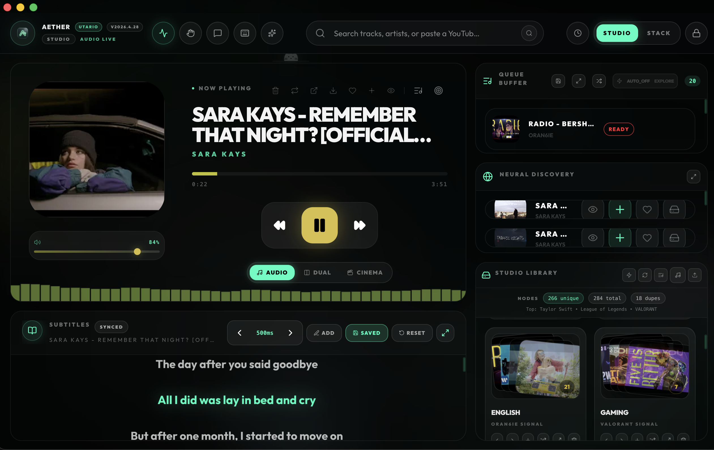
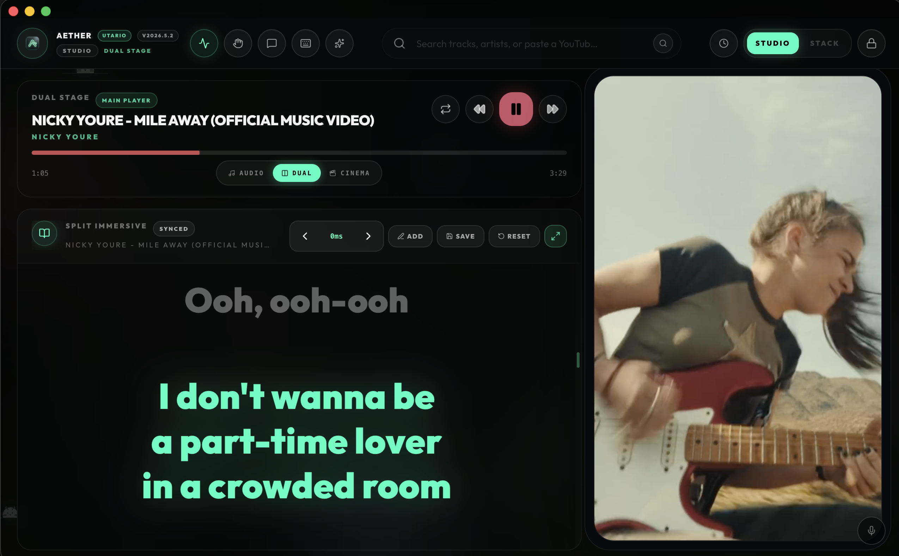
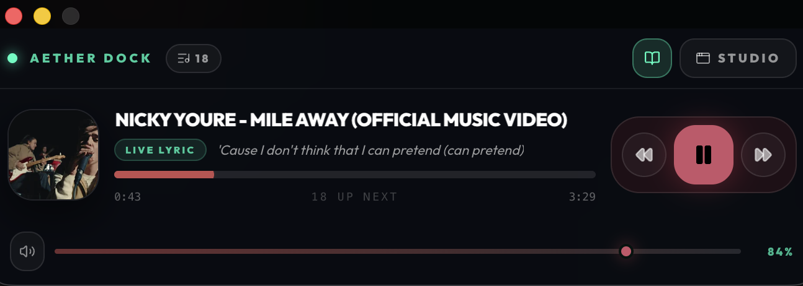
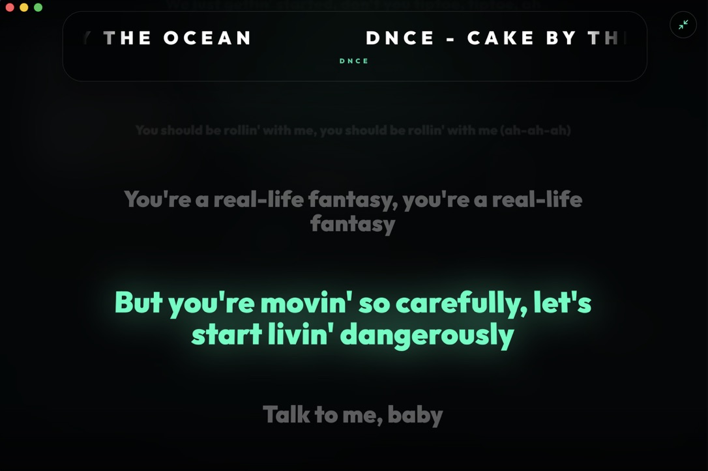
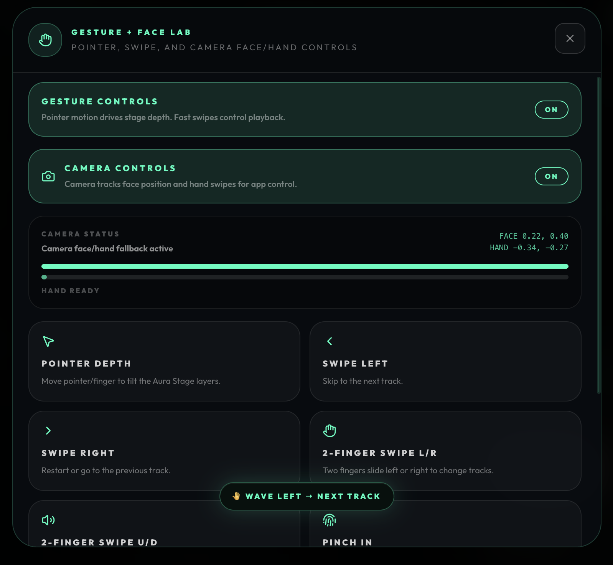
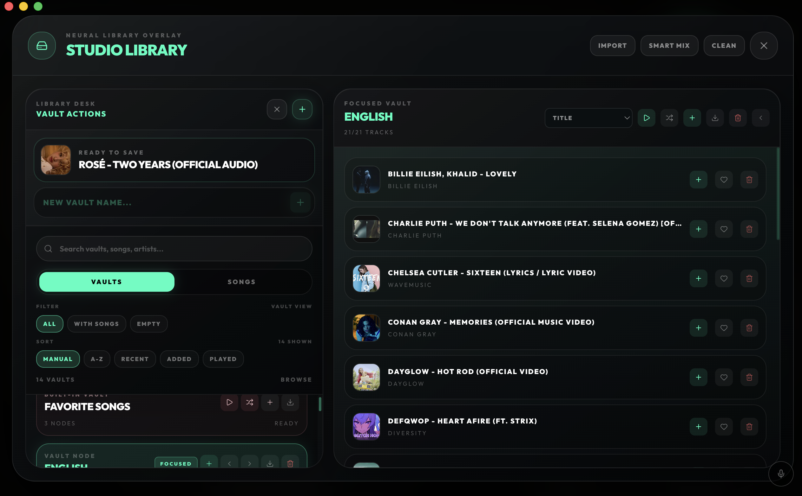
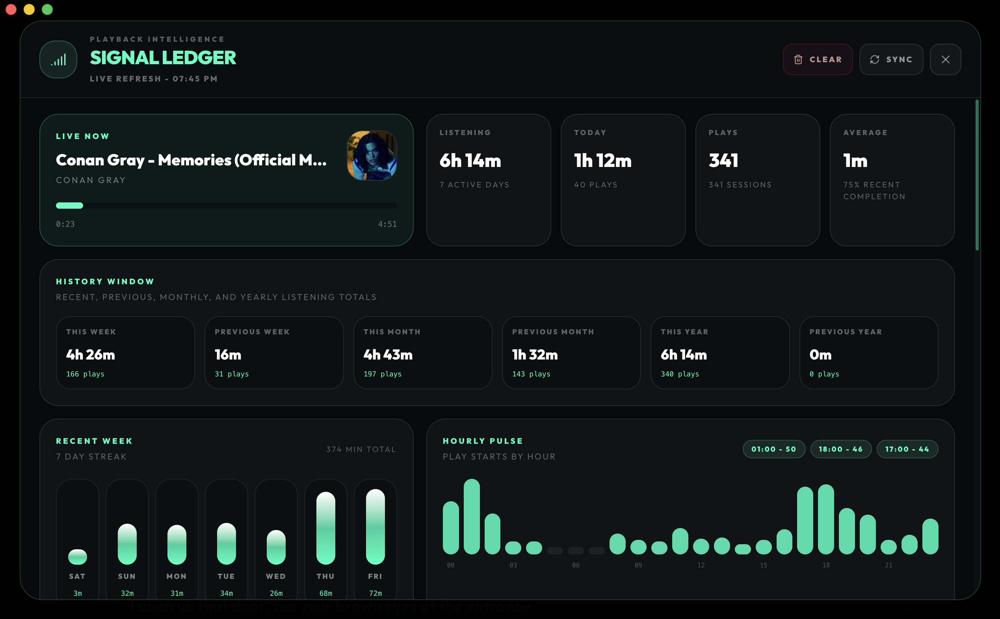

# Aether

<p align="center">
  <strong>A free desktop music studio for playback, synced lyrics, queues, visual modes, gestures, local libraries, and listening insights.</strong>
</p>

<p align="center">
  <a href="https://github.com/GSUS2K/Aether-Studio/releases/latest"></a>
  <a href="LICENSE"></a>
  <a href="https://github.com/GSUS2K/Aether-Studio/stargazers"></a>
  <a href="https://aetherstudio.me"></a>
</p>

<p align="center">
  
</p>

<p align="center">
  <a href="#download">Download</a>
  |
  <a href="#features">Features</a>
  |
  <a href="#screenshots">Screenshots</a>
  |
  <a href="#install">Install</a>
  |
  <a href="#run-from-source">Run from source</a>
  |
  <a href="#architecture">Architecture</a>
  |
  <a href="#roadmap">Roadmap</a>
</p>

## Overview

Aether is a free desktop music studio built for people who want a cleaner YouTube-style music experience with no ads, more control, and extra studio features.

It combines search, playback, queues, synced lyrics, playlists, visual playback modes, gesture controls, local library tools, offline helpers, diagnostics, and listening stats inside one desktop app.

The desktop app is the main experience. It runs with a local backend so media handling, playback tools, metadata, lyrics, storage, and local app behavior can work without depending on a public remote server.

Aether also has a lightweight website version at [aetherstudio.me](https://aetherstudio.me). The website is intentionally smaller than the desktop app and does not include every feature from the full application.

## Development Status

Aether is in active development.

The app is usable, but it is not the final polished version yet. Some areas may still have input lag, rendering issues, visual performance problems, or unfinished behavior depending on the device and playback mode.

Aether has not been tested on every platform and device yet. If you try it on your system and run into any bugs, crashes, playback issues, or UI problems, please report them through <a href="https://github.com/GSUS2K/Aether-Studio/issues">GitHub Issues</a> or the Issues button inside the Aether app.

Use <a href="https://github.com/GSUS2K/Aether-Studio/releases/tag/v2026.4.28">Aether v2026.4.28</a> if you want a smooth experience with almost no input lags.

The goal is to keep improving stability, performance, media handling, and the overall studio experience with each release.

Check out the easter egg in app by pressing anywhere on the app (ensure no buttons/input fields are in focus) and typing "MIXTAPE".

## Download

Get the latest build from the [GitHub Releases page](https://github.com/GSUS2K/Aether-Studio/releases/latest), or download directly below.

| Platform | Direct download |
| --- | --- |
| macOS Apple Silicon | [Aether-arm64.dmg](https://github.com/GSUS2K/Aether-Studio/releases/latest/download/Aether-arm64.dmg) |
| macOS Intel | [Aether-x64.dmg](https://github.com/GSUS2K/Aether-Studio/releases/latest/download/Aether-x64.dmg) |
| Windows | [Aether-Setup-x64.exe](https://github.com/GSUS2K/Aether-Studio/releases/latest/download/Aether-Setup-x64.exe) |
| Linux | [Aether-x86_64.AppImage](https://github.com/GSUS2K/Aether-Studio/releases/latest/download/Aether-x86_64.AppImage) |

## Features

| Area | What it does |
| --- | --- |
| Playback | Search, queue, play, pause, skip, previous, repeat, shuffle, seek, volume, and local transport control |
| Lyrics | Synced lyrics, manual lyrics, offset saving, immersive output, lyric click-to-seek, and dual visual lyrics |
| Visual modes | Audio mode, Dual Visual, Cinema mode, aura visuals, player bars, and performance modes |
| Gestures | Gesture-based controls for a more natural playback and studio navigation experience |
| Library | Studio Library, playlist vaults, favorites, import/export, sorting, filtering, and song browsing |
| Playlist imports | Import public playlists from Spotify and Apple Music, with debug logs for checking import issues |
| Offline | Download helpers, cache controls, storage estimates, and local playback recovery |
| Signal Ledger | Listening time, plays, recent sessions, top artists, hourly pulse, replay stats, and genre pulse |
| Desktop | Native window controls, updater support, diagnostics, app lock, shortcuts, and local media backend |
| Website companion | Minimal web version for basic access through the public site |

## Screenshots

<p align="center">
  
  
</p>

<p align="center">
  
</p>

<p align="center">
  
  
</p>

<p align="center">
  
</p>

<p align="center">
  
  
</p>


## Install

### macOS

1. Download the correct `.dmg` for your Mac.
2. Open the `.dmg`.
3. Drag Aether into Applications.
4. Launch Aether.
5. If macOS blocks the first launch, right click Aether and choose **Open**.
6. If still blocked, then go to Settings -> Privacy & Security -> Scroll to bottom and click on **Allow application** for Aether.

### Windows

1. Download `Aether-Setup-x64.exe`.
2. Run the installer.
3. Open Aether from the Start menu or desktop shortcut.
4. If Windows Security or your antivirus blocks yt-dlp, do the following command in Windows Powershell and rerun the app.

```powershell
Unblock-File "C:\Users\<system_name>\AppData\Local\Programs\Aether\resources\app.asar.unpacked\desktop\bin\yt-dlp.exe"
```

### Linux

```bash
chmod +x Aether-*.AppImage
./Aether-*.AppImage
```

### Homebrew

```bash
brew tap GSUS2K/tap
brew install --cask aether
```

## How To Use

1. Search for a song, artist, or playlist item.
2. Add tracks to the queue.
3. You can also import playlists from Spotify or Apple Music from the Studio Library Panel.
4. Use player controls, shortcuts, or gestures for playback.
5. Open lyrics and adjust sync if needed.
6. Save useful tracks into Studio Library playlists.
7. Use Dual Visual or Cinema mode when you want video playback.
8. Open Signal Ledger to review listening patterns.
9. Use Diagnostics when playback, search, lyrics, or storage needs inspection.

## Visual Modes

| Mode | Best for |
| --- | --- |
| Audio | Normal listening, lower visual overhead, player layout |
| Dual Visual | Video beside the main workspace with lyrics and controls still visible |
| Cinema | Full screen visual playback with a cleaner overlay |

Full frame preserves the entire source frame. Fill frame crops edges when needed to cover the stage.

## Performance Modes

| Mode | Behavior |
| --- | --- |
| Low | Removes decorative animation and heavy effects for the most stable UI |
| Medium | Keeps the app polished while limiting heavier visuals |
| High | Enables the full visual system and richer motion |

Aether still has some performance issues in the current builds, especially during music playback on some devices. A future update will focus on reducing unnecessary renders, improving responsiveness, and making the app smoother overall.

If you are debugging input delay, start with Low mode. If the delay disappears, the issue is likely related to visual effects, animation, or a high-frequency UI path.

## Run From Source

Install dependencies:

```bash
npm run install:all
```

Run the desktop app with Vite and Electron:

```bash
npm run dev:all
```

Build only the frontend:

```bash
npm run build-frontend
```

Create a macOS distributable:

```bash
npm run dist
```

Create a Windows installer:

```bash
npm run dist:win
```

## Architecture

Aether is split between a React interface, an Electron bridge, and a local media backend:


## Core Tools

Aether uses `yt-dlp` and `ffmpeg` for parts of its local media handling.

| Tool | Used for |
| --- | --- |
| yt-dlp | Fetching media information and stream data |
| ffmpeg | Media processing and playback support |

These tools are bundled and used by the desktop app where needed. If playback does not work on your system, check Diagnostics inside Aether and make sure these tools are available.

## Roadmap

Aether is still growing and changing over time. The goal is to turn it into a complete music experience instead of just another desktop player.

Some bigger ideas planned for the future:

| Area | Direction |
| --- | --- |
| Better music system | Move away from depending fully on yt-dlp by allowing music to be streamed from a separate server, home system, or Raspberry Pi |
| Listening together | Let users join the same room, listen together live, and control shared queues |
| Voice chat and webcam | Add optional voice chat and webcam support inside listening rooms |
| Upload your own music | Allow users to add their own songs, metadata, artwork, and synced lyrics |
| AI features | Users can add their own AI API key to use playlist help, music discovery, lyric tools, smart search, and other experimental features |
| Full customization | More control over layouts, visuals, themes, gestures, animations, and workspace behavior |
| Better syncing | Sync queues, playlists, history, and settings across devices |
| Sharing | Share songs, lyrics moments, playlists, queues, and visual states directly from the app |
| Shared libraries | Allow multiple users to build and manage playlists together |
| Visual experiences | More immersive visual playback spaces that react to music and user interaction |
| Performance improvements | Reduce lag, improve responsiveness, and make both the app and website feel smoother overall |
| Better website experience | Improve the website version over time with more features and better stability |
| Plugin support | Allow extra modules, integrations, and community-made extensions |
| Smarter offline support | Better downloads, cache handling, storage cleanup, and playback recovery |
| Better local library support | Improve support for personal music collections, metadata editing, and organization |
| More gesture features | Expand gesture controls for playback, navigation, and visual interaction |
| Artist and community features | Future support for artist pages, listening events, interactive releases, and community spaces |

## Release Notes

Downloads and version updates are published through GitHub Releases.

See the [latest release](https://github.com/GSUS2K/Aether-Studio/releases/latest) for installers, update files, and version details.

## Star History

[](https://www.star-history.com/#GSUS2K/Aether-Studio&Date)

## License

Aether is licensed under the MIT License. See [LICENSE](LICENSE) for details.
