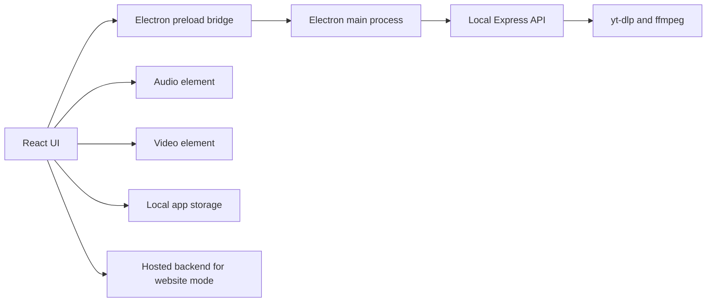

# Aether

<p align="center">
  <strong>A desktop music studio for playback, lyrics, queues, visual modes, local libraries, and listening intelligence.</strong>
</p>

<p align="center">
  <a href="https://github.com/GSUS2K/Aether-Studio/releases"></a>
  <a href="LICENSE"></a>
  <a href="https://github.com/GSUS2K/Aether-Studio/stargazers"></a>
  <a href="https://aetherstudio.me"></a>
</p>

<p align="center">
  <a href="#download">Download</a>
  |
  <a href="#features">Features</a>
  |
  <a href="#run-from-source">Run from source</a>
  |
  <a href="#run-from-source">Development</a>
  |
  <a href="#troubleshooting">Troubleshooting</a>
</p>

## Overview

Aether is built for people who want a music app that feels alive without getting in the way. It combines search, queueing, synced lyrics, offline helpers, playlists, visual playback modes, diagnostics, and local-first desktop behavior in one app.

The desktop app runs its own local backend, so playback, streaming, metadata, lyrics, and storage tools can work without relying on a remote server. The public website uses a smaller hosted backend for web-safe search and playback.

## Download

Get the latest build from:

[github.com/GSUS2K/Aether-Studio/releases](https://github.com/GSUS2K/Aether-Studio/releases)

Choose the asset for your platform:

| Platform | Download |
| --- | --- |
| macOS Apple Silicon | `Aether-arm64.dmg` |
| macOS Intel | `Aether-x64.dmg` |
| Windows | `Aether-Setup-x64.exe` |
| Linux | `Aether-x86_64.AppImage` |

## Features

| Area | What it does |
| --- | --- |
| Playback | Search, queue, play, pause, skip, previous, repeat, shuffle, seek, volume, and local transport control |
| Lyrics | Synced lyrics, manual lyrics, offset saving, immersive output, lyric click-to-seek, and dual visual lyrics |
| Visual modes | Audio mode, Dual Visual, Cinema mode, aura visuals, player bars, and performance modes |
| Library | Studio Library, playlist vaults, favorites, import/export, sorting, filtering, and song browsing |
| Imports | Spotify and Apple Music playlist import flows with debug logs |
| Offline | Download helpers, cache controls, storage estimates, and local playback recovery |
| Signal Ledger | Listening time, plays, recent sessions, top artists, hourly pulse, replay stats, and genre pulse |
| Desktop | Native window controls, updater support, diagnostics, app lock, shortcuts, and local media backend |
| Web | Public frontend support through a hosted API backend |

## Screenshots

## Install

### macOS

1. Download the correct `.dmg`.
2. Open it.
3. Drag Aether into Applications.
4. Launch Aether.
5. If macOS blocks the first launch, right-click Aether and choose Open.

### Windows

1. Download `Aether-Setup-x64.exe`.
2. Run the installer.
3. Open Aether from the Start menu or desktop shortcut.

### Linux

```bash
chmod +x Aether-*.AppImage
./Aether-*.AppImage
```

### Homebrew

```bash
brew tap GSUS2K/tap
brew install --cask aether
```

## How To Use

1. Search for a song, artist, or playlist item.
2. Add tracks to the queue.
3. Use the player controls for transport and volume.
4. Open lyrics and adjust sync if needed.
5. Save useful tracks into Studio Library playlists.
6. Use Dual Visual or Cinema mode when you want video-led playback.
7. Open Signal Ledger to review listening patterns.
8. Use Diagnostics when playback, search, lyrics, or storage needs inspection.

## Visual Modes

| Mode | Best for |
| --- | --- |
| Audio | Normal listening, lowest visual overhead, player-first layout |
| Dual Visual | Video beside the main workspace with lyrics and controls still visible |
| Cinema | Full-screen visual playback with a cleaner overlay |

Full frame preserves the entire source frame. Fill frame crops edges when needed to cover the stage.

## Performance Modes

| Mode | Behavior |
| --- | --- |
| Low | Removes decorative animation and heavy effects for the most stable UI |
| Medium | Keeps the app polished while limiting heavier visuals |
| High | Enables the full visual system and richer motion |

If you are debugging input delay, start with Low mode. If the delay disappears, the issue is likely a visual effect or high-frequency UI path.

## Run From Source

Install dependencies:

```bash
npm run install:all
```

Run the desktop app with Vite and Electron:

```bash
npm run dev:all
```

Build only the frontend:

```bash
npm run build-frontend
```

Create a macOS distributable:

```bash
npm run dist
```

Create a Windows installer:

```bash
npm run dist:win
```

## Development Shape

Aether is split between a React interface, an Electron bridge, and a local media backend:



## Website Backend

The public website can point to a hosted backend through:

```text
VITE_API_BASE_URL=https://your-backend.example.com
```

The current website backend is maintained separately from the desktop app. Cloud playback may require YouTube cookies configured as a private Render environment variable because YouTube can block server-side requests from cloud hosts.

Never commit cookies or tokens.

## Troubleshooting

<details>
<summary>Search works but playback does not start on the website</summary>

Check the browser console for `/stream`. If it returns `502`, the hosted backend is probably being blocked by YouTube and needs a valid private cookie environment variable.

</details>

<details>
<summary>Desktop playback stalls</summary>

Open Diagnostics. Check the engine state, stream port, queue state, storage state, and whether `yt-dlp` is available. Restarting the app can also clear stale local stream workers.

</details>

<details>
<summary>Lyrics are early or late</summary>

Use the lyric offset controls. Save the offset once it matches the song. Future plays can reuse the saved offset for that track.

</details>

<details>
<summary>The UI feels heavy</summary>

Switch to Low performance mode first. If the app becomes responsive, the problem is probably a decorative animation, visualizer path, or high-frequency render path.

</details>

## Star History

[](https://www.star-history.com/#GSUS2K/Aether-Studio&Date)

## Release Notes

Release assets are built with Electron Builder and published through GitHub Releases. Auto-update metadata is generated alongside the installers.

## License

Aether is licensed under the MIT License. See [LICENSE](LICENSE) for details.
